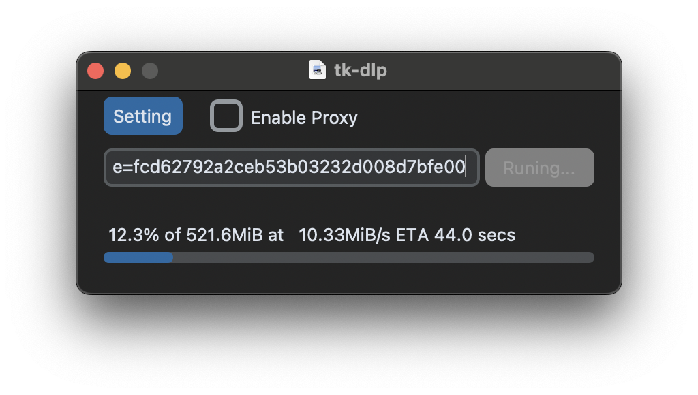

# 📦 tk-dlp

A GUI wrapper for [yt-dlp](https://github.com/yt-dlp/yt-dlp/) built with [CustomTkinter](https://customtkinter.tomschimansky.com/).


# 📥 Download
Currently, only 64-bit Windows executable binaries are available.
Get the latest release from the [Releases page]().

# 🛠️ Build from Source

## 1. Create a Python Environment
Using Conda (recommended):
```bash
conda create -n tk-dlp python=3.12
conda activate tk-dlp
pip install -r requirements.txt
```
## 2. Build Executable

### Windows

```cmd
build.cmd
```

## 3. Run
After building, you can find the executable in:`dist/`. Run it and enjoy 🎉


# 📄 License
This project is licensed under the MIT License.